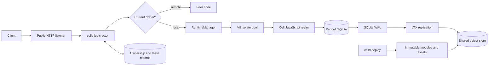
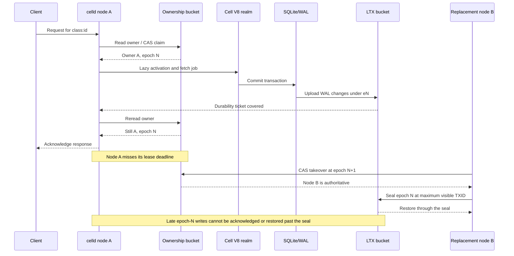

# celld Architecture and Distributed Systems Study Guide

This guide uses celld as a concrete way to learn Durable Objects, actors,
distributed ownership, fencing, write-ahead logging, log replication, failure
semantics, and deterministic distributed-systems testing.

It is written for developers who understand ordinary application servers and
databases but are new to Durable Objects and distributed coordination.

## Learning goals

After working through this guide, you should be able to explain:

1. What a Durable Object is and why it differs from a stateless service.
2. Why celld treats JavaScript residency as a cache rather than durable state.
3. How one logical cell is routed to one authoritative node.
4. Why leases alone cannot prevent split brain.
5. How ownership epochs and fencing make stale owners harmless.
6. Why a local SQLite commit is not necessarily a durable acknowledgement.
7. How SQLite WAL changes become recoverable LTX history.
8. Why some peer failures are safe to retry and others are ambiguous.
9. How a functional core and deterministic simulation simplify failure testing.

## The shortest useful mental model

celld is a self-hosted runtime for JavaScript Workers and Durable Objects. A
Durable Object is a named logical entity that combines:

- Computation.
- Private persistent state.
- Coordination for work addressed to the same identity.

celld calls each Durable Object a **cell**. A cell has five distinct parts:

| Part | Meaning |
| --- | --- |
| Identity | A stable name such as `Counter:room-42` |
| Residency | A temporary JavaScript realm in a V8 isolate |
| State | A private SQLite database |
| Authority | A bucket record naming the current owner and epoch |
| Recovery history | LTX data created from SQLite WAL changes |

A useful analogy is a named office:

- The cell identity is the permanent address.
- The V8 realm is the temporary workspace.
- SQLite is the durable notebook.
- The ownership record says which node currently holds the key.
- The epoch is the key's serial number, making an older key invalid.

The analogy is only an introduction. The real implementation uses
compare-and-swap ownership records, expiring leases, monotonically increasing
epochs, SQLite WAL, and epoch-separated LTX history.

## Durable Objects from first principles

### The stateless-server model

In a conventional web application:

1. Any server may receive any request.
2. Shared state lives in an external database.
3. Concurrent requests coordinate through transactions, locks, queues, or
   application-level conflict handling.

This model is excellent for independent requests, but stateful entities such as
chat rooms, documents, game sessions, and agents often require additional
coordination.

### The Durable Object model

A Durable Object uses the entity identity as the unit of routing, state, and
coordination:

1. Application code selects an object identity.
2. The runtime finds the identity's current owner.
3. Work for that identity is delivered to its execution context.
4. Durable data is stored with that identity.
5. The execution context may later disappear and be reconstructed.

The counter example demonstrates the Cloudflare-compatible API:

```js
const id = env.COUNTER.idFromName("room-42");
const counter = env.COUNTER.get(id);
return counter.fetch(request);
```

See [`examples/counter/index.js`](examples/counter/index.js) and identity
normalization in
[`crates/celld/runtime.rs`](crates/celld/runtime.rs#L495-L502).

The important consequence is **sharding by construction**. Runtime residency,
ownership, SQLite state, alarms, and replication all use the cell identity as
their common key.

## Repository map

The workspace separates behavioral decisions from side effects:

| Path | Responsibility |
| --- | --- |
| [`crates/logic`](crates/logic) | Lifecycle, routing, ownership, fencing, scheduling, alarms, pressure, and failure decisions |
| [`crates/celld/main.rs`](crates/celld/main.rs) | Process startup and the serial logic actor |
| [`crates/celld/runtime.rs`](crates/celld/runtime.rs) | V8 runtimes, cell activation, jobs, isolate pools, and Rust/JavaScript bridging |
| [`crates/celld/storage.rs`](crates/celld/storage.rs) | Per-cell SQLite, key-value operations, transactions, metadata, and alarms |
| [`crates/celld/ownership_store.rs`](crates/celld/ownership_store.rs) | Bucket-backed ownership and node-lease records |
| [`crates/celld/ltx_repl.rs`](crates/celld/ltx_repl.rs) | LTX upload, durability waits, restore, sealing, and eviction snapshots |
| [`crates/ltx`](crates/ltx) | LTX format, compaction, replicas, WAL parsing, and restore |
| [`crates/celld/protocol.rs`](crates/celld/protocol.rs) | Deployment manifests, assets, feature requirements, and deployment pointers |
| [`crates/celld/deploy.rs`](crates/celld/deploy.rs) | Bundling, content hashing, immutable upload, and publication |
| [`docs/fencing.md`](docs/fencing.md) | Ownership, acknowledgement, and epoch-sealing invariants |
| [`docs/testing.md`](docs/testing.md) | Differential, deterministic, and live-fleet testing |

## High-level architecture



One celld process may host:

- A stateless Worker runtime.
- Many resident cells.
- V8 isolate pools.
- Public HTTP ingress.
- Internal peer and operator endpoints.
- Lease renewal and ownership routing.
- Alarm wake-up machinery.
- SQLite databases and LTX replication tasks.

One process is not one Durable Object.

## Pattern 1: functional core, imperative shell

The process has a single serial owner of `celld_logic::on_event`. The logic
core receives events, updates its state, and requests effects. Asynchronous
adapters perform those effects and return completion events through the
mailbox.

The distinction is:

- The core decides **what should happen**.
- The shell performs **network, object-store, V8, SQLite, and timer work**.

See the architecture comments and actor loop in
[`crates/celld/main.rs`](crates/celld/main.rs#L1-L9).

This design makes failure ordering explicit. A test can model:

- A lease renewal completing late.
- An ownership CAS losing a race.
- A peer response disappearing.
- A replication upload completing after takeover.

without requiring every test to reproduce those timings against a real
network.

The serial actor does not mean that the server executes one JavaScript request
at a time. It serializes lifecycle decisions while adapters and V8 execution
remain concurrent.

## Pattern 2: virtual actors and lazy activation

A cell's identity is durable, but its runtime is not.

When work first arrives for a nonresident cell, celld:

1. Resolves or claims ownership.
2. Assigns a new ownership epoch.
3. Restores or opens SQLite.
4. Selects the Durable Object class and script.
5. Places the cell in an isolate pool.
6. Constructs its JavaScript state.
7. Publishes the cell handle only after activation succeeds.

The activation path is in
[`crates/celld/runtime.rs`](crates/celld/runtime.rs#L787-L918).

Published cells retain a residency handle so later work can find the same
isolate slot:
[`crates/celld/runtime.rs`](crates/celld/runtime.rs#L921-L928).

Residency is an optimization:

- JavaScript fields may survive while the realm remains resident.
- They disappear after eviction, process failure, or takeover.
- SQLite-backed state survives those transitions.

Application code must therefore treat memory as a cache and SQLite as the
source of truth.

## Pattern 3: V8 turns and cell concurrency

A V8 **turn** is one synchronous entry into JavaScript.

When a handler awaits:

1. JavaScript runs until the await point.
2. celld releases the isolate.
3. Host-side work completes outside V8.
4. celld reacquires the isolate.
5. The promise result is delivered in another turn.

See [`crates/logic/isolate.rs`](crates/logic/isolate.rs#L1-L17) and
[`crates/celld/runtime.rs`](crates/celld/runtime.rs#L1800-L1905).

This means an entire async handler is not one uninterrupted critical section.

`blockConcurrencyWhile` closes the cell's input gate. New events wait outside
the isolate until all nested gate holds are released:
[`crates/logic/gate.rs`](crates/logic/gate.rs#L68-L130).

It is not a universal mutex around every request. It is an explicit mechanism
for work, such as initialization, that must complete before another event is
delivered.

Fetches, RPC calls, alarms, and WebSocket events all become cell jobs and use
the same execution machinery:
[`crates/celld/runtime.rs`](crates/celld/runtime.rs#L1068-L1159).

## Pattern 4: one private SQLite database per cell

Each cell scope has its own SQLite connection and database:
[`crates/celld/storage.rs`](crates/celld/storage.rs#L7-L14).

Initialization enables WAL and creates internal tables for:

- Key-value storage.
- Alarm state.
- Cell metadata.

See [`crates/celld/storage.rs`](crates/celld/storage.rs#L250-L326).

Transactions use SQLite's transactional guarantees. Key-value transaction
callbacks commit only after successful callback completion:
[`crates/celld/storage.rs`](crates/celld/storage.rs#L2287-L2301).

The per-cell database model provides:

- A small failure and contention domain.
- Local transactional coordination for one entity.
- Natural placement and migration boundaries.
- No need for application-level distributed locking inside one cell.

The tradeoff is that cross-cell transactions are not the normal programming
model. Applications should choose identities that place data requiring atomic
coordination in the same cell.

## Pattern 5: leases, ownership records, and epochs

The shared bucket is the fleet's coordination authority.

Important records include:

- `nodes/<node>.json`: an expiring node-session lease.
- `cells/<cell>/own.json`: the cell's current owner and epoch.

A node lease includes identity, advertised address, expiry, protocol version,
process generation, and advisory load:
[`crates/logic/types.rs`](crates/logic/types.rs#L145-L187).

An ownership record includes the owner, a monotonically increasing epoch, and
the ETag used for compare-and-swap:
[`crates/logic/types.rs`](crates/logic/types.rs#L136-L143).

### Compare-and-swap

Compare-and-swap means:

> Replace this object only if it still has the version I previously read.

Competing nodes may both believe they are good placement candidates, but only
one conditional ownership update can succeed:
[`crates/celld/ownership_store.rs`](crates/celld/ownership_store.rs#L281-L303).

The placement heuristic is advisory. The ownership CAS is authoritative.

### Why leases are not sufficient

A timed-out process is not necessarily dead. It may be:

- Paused by the scheduler.
- Experiencing a long garbage-collection or system stall.
- Partitioned from the bucket.
- Unable to receive responses even though its writes completed.

Another node may take over while the old process is still running.

This is the split-brain problem. celld addresses it with epochs and fencing.

### Epochs

Every takeover increments the ownership epoch:

- Node A owns epoch 7.
- Node B takes over at epoch 8.
- Any later action from node A remains associated with epoch 7.

The epoch identifies the current ownership generation. It is meaningful only
because all correctness-sensitive paths use it.

## Pattern 6: fencing stale owners

Fencing prevents a stale owner from making authoritative changes even if the
old process continues running.

celld fences the control and data paths:

1. Ownership transitions require compare-and-swap.
2. LTX data is written below an epoch-specific prefix.
3. Responses wait for remote durability.
4. Ownership is reread before acknowledgement.
5. A response is acknowledged only if the same node still owns the same epoch.
6. Restore seals the previous epoch at a fixed maximum transaction ID.

See [`docs/fencing.md`](docs/fencing.md).

An epoch prefix alone is not enough. A stale node could continue uploading into
its old prefix. The acknowledgement reread prevents those writes from being
reported as successful, and the restore seal prevents late writes from
reappearing during a future recovery.

## Pattern 7: SQLite WAL and LTX log shipping

SQLite uses a **write-ahead log**, or WAL. Committed page changes are appended
to the WAL before they are merged into the primary database file.

celld converts committed WAL changes into LTX transaction history. Each active
cell and epoch has:

- A managed local SQLite database.
- Monotonic transaction IDs.
- An object-store replica below `cells/<cell>/ltx/e<epoch>/`.

See [`crates/celld/ltx_repl.rs`](crates/celld/ltx_repl.rs#L1-L15) and
[`crates/ltx/src/lib.rs`](crates/ltx/src/lib.rs#L1-L15).

### Write acknowledgement

With the default output gate enabled:

1. JavaScript commits a SQLite mutation.
2. The mutation receives a durability ticket.
3. A background sync captures the corresponding WAL changes.
4. LTX data is uploaded under the current epoch.
5. celld waits until the ticket is covered.
6. celld rereads the ownership record.
7. It verifies the same node and epoch.
8. Only then may the request be acknowledged.

The durability-ticket machinery is in
[`crates/celld/ltx_repl.rs`](crates/celld/ltx_repl.rs#L548-L606).

This is the basis for the stated RPO=0 goal for acknowledged writes:
[`docs/testing.md`](docs/testing.md#L1-L8).

`CELLD_OUTPUT_GATE=0` deliberately removes this wait and weakens that
guarantee.

## Write and takeover sequence



## Pattern 8: conservative retry semantics

A non-owner forwards work to the current owner over the peer protocol.

celld retries only when it knows execution did not happen or the authoritative
peer explicitly refused the request:

- An explicit `not owner` response is retryable.
- A connection that was never established is retryable.
- A timeout or truncated response after bytes were sent is ambiguous and is
  not automatically retried.

See [`crates/logic/routing.rs`](crates/logic/routing.rs#L1-L60).

The ambiguous case matters because the remote owner may have executed the
operation and lost only the response. Retrying a non-idempotent operation could
apply it twice.

This is at-most-once retry discipline, not a magical exactly-once network
guarantee.

## Pattern 9: immutable deployments and pointer publication

`celld deploy`:

1. Reads the Wrangler project.
2. Bundles Worker code with esbuild.
3. Hashes modules, metadata, and assets.
4. Uploads immutable objects.
5. Publishes manifests.
6. Updates `deploy/current.json` last.

See [`crates/celld/deploy.rs`](crates/celld/deploy.rs#L268-L420).

Publishing the pointer last means nodes should observe either the old complete
deployment or the new complete deployment, rather than a pointer to missing
artifacts.

The manifest also declares required runtime features so an incompatible node
can reject a deployment before loading it:
[`crates/celld/protocol.rs`](crates/celld/protocol.rs#L36-L45).

## Pattern 10: deterministic and adversarial testing

celld's decision core can be driven by controlled events, making failures
repeatable rather than timing-dependent.

The testing strategy has three layers:

1. Differential compatibility tests.
2. Deterministic adversarial simulation.
3. Real-fleet fault injection.

See [`docs/testing.md`](docs/testing.md#L10-L104).

Important properties include:

- One writer per cell epoch.
- No acknowledged write missing from the recoverable lineage.
- Stale owners cannot acknowledge writes.
- Ambiguous peer failures are not retried unsafely.
- Takeover and restoration preserve sealed history.

## Complete request trace

### First request to a cold cell

1. Worker code selects an identity and calls the Durable Object stub.
2. celld normalizes the identity to `class:id`.
3. The logic core reads ownership and node-lease state.
4. A live remote owner produces a peer route.
5. Otherwise, a candidate competes for ownership through CAS.
6. The winner receives a new epoch.
7. Replication reuses a safe local snapshot or restores sealed remote history.
8. The runtime selects the script and places the cell in an isolate.
9. SQLite and JavaScript state are initialized.
10. The runtime publishes the cell handle.
11. The fetch becomes a cell job.
12. `drive_cell` checks the input gate and enters V8.
13. The handler runs across one or more V8 turns.
14. The response completes after required durability and ownership checks.

### Subsequent request to a resident cell

1. Ownership is still checked; residency is not ownership authority.
2. The published cell handle locates the existing isolate slot.
3. Database restore and JavaScript construction are avoided.
4. The event waits if the input gate is closed.
5. JavaScript may observe cached in-memory fields.
6. Only SQLite-backed values are guaranteed to survive later reconstruction.

### Node failure and takeover

1. The old node misses its lease deadline and self-fences.
2. Another node observes unusable ownership.
3. It conditionally claims ownership at `epoch + 1`.
4. It selects and seals the previous recoverable epoch.
5. It reconstructs SQLite through the sealed transaction ID.
6. Stale uploads remain in an obsolete epoch.
7. The old node cannot pass the acknowledgement ownership check.

## Important terms

| Term | Meaning in celld |
| --- | --- |
| Actor | A state owner that processes messages through a mailbox |
| Cell | celld's Durable Object: one named logical entity |
| Isolate | A V8 JavaScript execution sandbox |
| Realm | The JavaScript environment belonging to a cell |
| Turn | One synchronous entry into JavaScript |
| Residency | A cell's temporary assignment to an isolate slot |
| Lease | Time-limited evidence that a node session remains authoritative |
| Epoch | A monotonically increasing ownership generation |
| CAS | Conditional write that succeeds only against the expected prior version |
| Fencing | Preventing stale owners from making authoritative changes |
| WAL | SQLite write-ahead log |
| LTX | Ordered SQLite transaction history stored outside the node |
| RPO | Recovery Point Objective: how much acknowledged data may be lost |
| Seal | The maximum transaction from an old epoch allowed in future restores |

## Papers and technical references

### Recommended first reading

1. [Orleans: Distributed Virtual Actors for Programmability and Scalability](https://www.microsoft.com/en-us/research/publication/orleans-distributed-virtual-actors-for-programmability-and-scalability/)
   Sergey Bykov et al., SoCC 2014. The closest conceptual match to celld's
   stable identities, lazy activation, placement, and passivation.

2. [Time, Clocks, and the Ordering of Events in a Distributed System](https://lamport.azurewebsites.net/pubs/time-clocks.pdf)
   Leslie Lamport, 1978. The foundation for reasoning about distributed
   ordering, logical generations, and why wall-clock observations are not a
   global history.

3. [Leases: An Efficient Fault-Tolerant Mechanism for Distributed File Cache Consistency](https://doi.org/10.1145/74850.74870)
   Cary Gray and David Cheriton, SOSP 1989. Explains time-limited authority and
   why lease renewal must account for delay and uncertainty.

4. [The Chubby Lock Service for Loosely-Coupled Distributed Systems](https://www.usenix.org/legacy/events/osdi06/tech/full_papers/burrows/burrows.pdf)
   Mike Burrows, OSDI 2006. The closest precedent for celld's sessions,
   ownership generations, and stale-client fencing.

5. [Implementing Remote Procedure Calls](https://doi.org/10.1145/2080.357392)
   Andrew Birrell and Bruce Nelson, ACM TOCS 1984. Explains duplicate
   suppression, retransmission, and ambiguous failures.

6. [SQLite Write-Ahead Logging](https://www.sqlite.org/wal.html)
   Authoritative SQLite documentation. Read this before the more formal ARIES
   paper.

7. [ARIES: A Transaction Recovery Method Supporting Fine-Granularity Locking and Partial Rollbacks Using Write-Ahead Logging](https://doi.org/10.1145/128765.128770)
   C. Mohan et al., ACM TODS 1992. The foundational treatment of write-ahead
   logging, recovery, redo, undo, and checkpoints.

### Deeper coordination theory

8. [Linearizability: A Correctness Condition for Concurrent Objects](https://cs.brown.edu/people/mph/HerlihyW90/p463-herlihy.pdf)
   Maurice Herlihy and Jeannette Wing, ACM TOPLAS 1990. Defines what it means
   for a conditional ownership transition to appear atomic.

9. [Unreliable Failure Detectors for Reliable Distributed Systems](https://doi.org/10.1145/226643.226647)
   Tushar Chandra and Sam Toueg, JACM 1996. Formal background for why a timeout
   is suspicion rather than proof of death.

10. [In Search of an Understandable Consensus Algorithm](https://raft.github.io/raft.pdf)
    Diego Ongaro and John Ousterhout, USENIX ATC 2014. Read as a contrast:
    celld epochs resemble terms, but celld uses object-store conditional writes
    instead of operating an internal consensus group.

11. [ZooKeeper: Wait-free Coordination for Internet-scale Systems](https://www.usenix.org/legacy/events/atc10/tech/full_papers/Hunt.pdf)
    Patrick Hunt et al., USENIX ATC 2010. Another useful contrast between a
    dedicated consensus-backed coordinator and celld's bucket-backed records.

### Stateful serverless systems and testing

12. [Cloudburst: Stateful Functions-as-a-Service](https://arxiv.org/abs/2001.04592)
    Vikram Sreekanti et al., PVLDB 2020. Covers state locality, stateful
    serverless execution, routing, and mutable caches.

13. [Ray: A Distributed Framework for Emerging AI Applications](https://www.usenix.org/conference/osdi18/presentation/moritz)
    Philipp Moritz et al., OSDI 2018. A modern distributed actor runtime. Ray
    actors are not automatically durable virtual actors, making the comparison
    useful.

14. [Spanner: Google's Globally-Distributed Database](https://www.usenix.org/conference/osdi12/technical-sessions/presentation/corbett)
    James Corbett et al., OSDI 2012. Useful for understanding why a local commit
    and a safely acknowledged replicated commit are different events.

15. [FoundationDB: A Distributed Unbundled Transactional Key Value Store](https://www.foundationdb.org/files/fdb-paper.pdf)
    SIGMOD 2021. Particularly relevant to celld's use of deterministic
    simulation and adversarial failure schedules.

### Historical actor source

16. [A Universal Modular ACTOR Formalism for Artificial Intelligence](https://dspace.mit.edu/handle/1721.1/4155)
    Carl Hewitt, Peter Bishop, and Richard Steiger, 1973. The original actor
    model source. It is historically important but less approachable than the
    Orleans paper.

## Suggested study plan

### Session 1: actors and identities

Read:

- The first half of the Orleans paper.
- `examples/counter/index.js`.
- `crates/celld/runtime.rs` identity and activation sections.

Be able to answer:

- What remains stable when a cell is evicted?
- What is lost?
- Why is a cell not the same thing as a V8 isolate?

### Session 2: concurrency

Read:

- `crates/logic/isolate.rs`.
- `crates/logic/gate.rs`.
- The `drive_cell` path in `crates/celld/runtime.rs`.

Be able to answer:

- What is a V8 turn?
- Where can async handlers interleave?
- What does `blockConcurrencyWhile` actually block?

### Session 3: ownership and fencing

Read:

- The leases paper.
- The Chubby paper's sections on sessions and sequencers.
- `docs/fencing.md`.
- `crates/celld/ownership_store.rs`.

Be able to answer:

- Why can the old owner still be alive after takeover?
- Why does every takeover increment the epoch?
- Why is the acknowledgement ownership reread necessary?

### Session 4: durability and restore

Read:

- SQLite WAL documentation.
- The introduction and recovery overview of ARIES.
- `crates/celld/ltx_repl.rs`.
- `crates/ltx/src/replica.rs`.

Be able to answer:

- What is the difference between local commit and remote durability?
- What does an LTX transaction ID represent?
- Why must restore seal an old epoch?

### Session 5: network failure semantics

Read:

- Implementing Remote Procedure Calls.
- `crates/logic/routing.rs`.
- `crates/celld/peer_auth.rs`.

Be able to answer:

- When does a timeout mean an operation did not execute?
- Why is `not owner` safely retryable?
- Why can a lost response make the result unknowable?

### Session 6: testing distributed state machines

Read:

- The FoundationDB paper's simulation sections.
- `docs/testing.md`.
- Representative tests in `crates/logic`.

Be able to answer:

- Why is deterministic event ordering valuable?
- Which parts of celld are suitable for deterministic simulation?
- Which properties still require real-fleet fault injection?

## Hands-on exercises

1. Trace the counter example from `idFromName` through `fetch_cell`.
2. Find every place that uses the ownership epoch and classify it as a control
   fence, data fence, or acknowledgement fence.
3. Follow a storage mutation from JavaScript through SQLite and its durability
   ticket.
4. Explain what happens if the LTX upload succeeds but the response is lost.
5. Explain what happens if the ownership CAS succeeds but the caller times out.
6. Trace an alarm from persistent storage to wake-up and handler execution.
7. Compare celld's bucket coordination to a hypothetical ZooKeeper or Raft
   control plane.
8. Identify which state is safe to cache in JavaScript memory and which must be
   stored in SQLite.
9. Describe an application that fits one-cell-per-entity sharding and one that
   does not.
10. Design a failure test for a stale owner uploading after takeover.

## Operational limitations that shape the design

- The object store must correctly enforce conditional writes and
  read-after-write behavior.
- A generic S3-compatible API is not sufficient if those semantics are weak.
- Peer HTTP does not terminate TLS.
- The operator API is unauthenticated.
- Internal listeners therefore require a private or encrypted network.
- Bucket credentials grant authority over deployments, ownership, and durable
  data.
- There is no central placement or automatic rebalancing controller.
- Replicas are recovery material, not read-serving replicas.
- Telemetry is optional and may be shed under load.
- Current source establishes recovery correctness, not a universal restore-time
  guarantee.

See [`docs/security.md`](docs/security.md),
[`docs/limitations.md`](docs/limitations.md), and
[`docs/telemetry.md`](docs/telemetry.md).

## Final review questions

You have a working mental model when you can answer these without referring to
the code:

1. What exactly is durable about a Durable Object?
2. Why is a resident JavaScript object only a cache?
3. How can two nodes both believe the previous owner failed?
4. Why does celld require a CAS rather than an ordinary object-store write?
5. Why is a lease not a fencing token?
6. What prevents a stale node from acknowledging a write?
7. What prevents its late replicated data from reappearing during restore?
8. Why does celld sometimes refuse to retry a failed peer request?
9. How does per-cell SQLite simplify application coordination?
10. Which parts of celld's design depend on strong object-store semantics?
